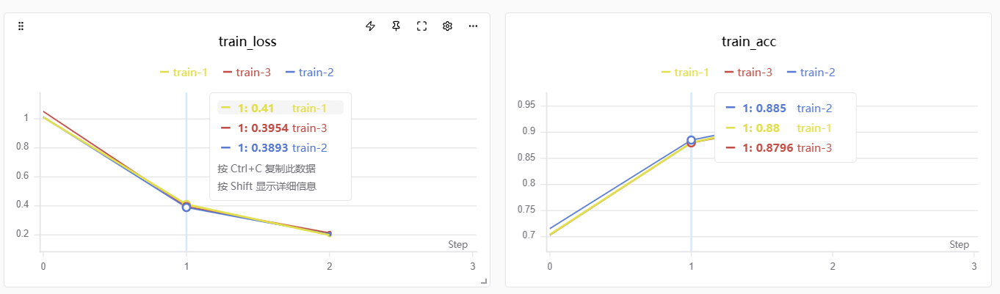
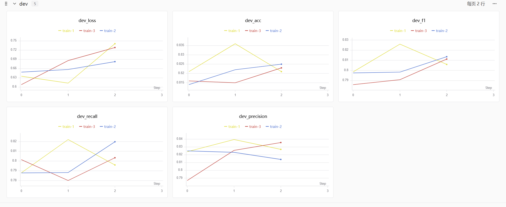
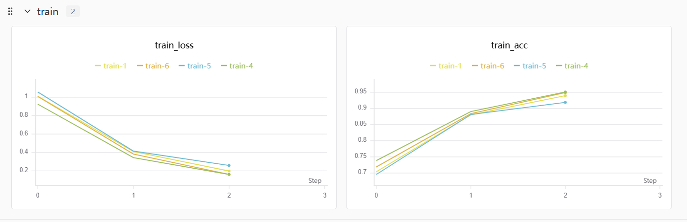
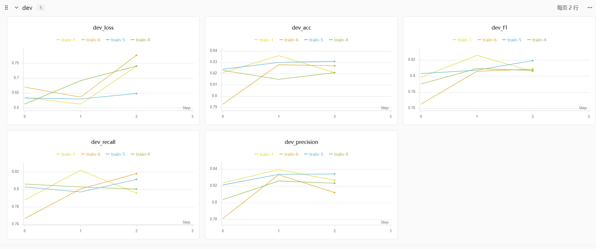
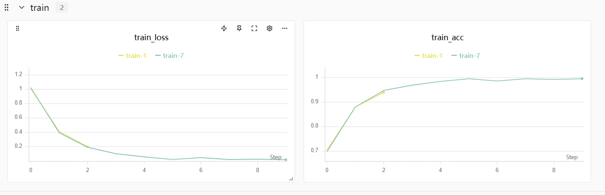
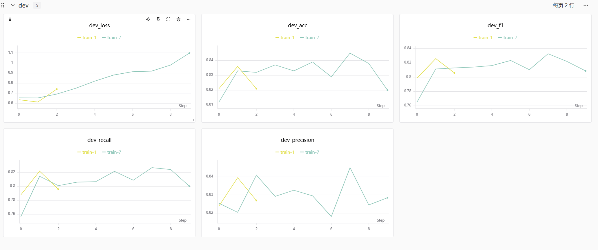
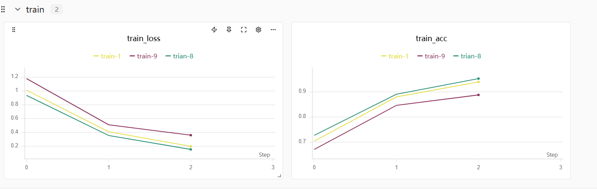
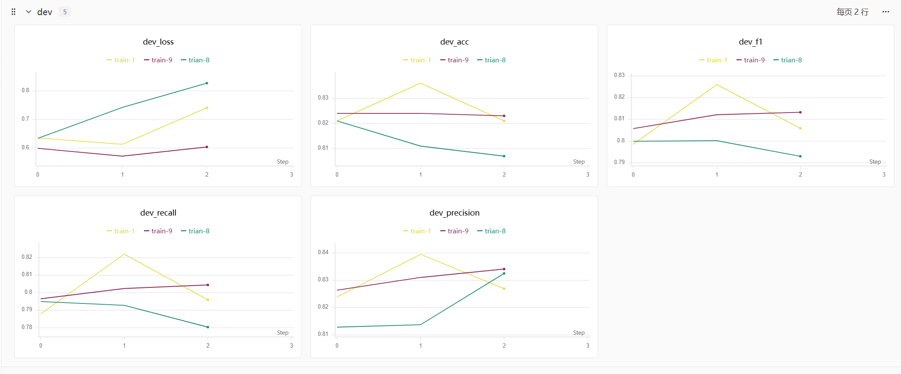

# ITREC 新生训练营demo1
该项目基于bert-base模型进行fine-tuning, 在原有模型的基础上添加分类头，以完成新闻头条文本分类的任务。<br>
具体数据集和demo说明参考仓库：**https://github.com/DMU-ITREC/itrec-nlp-newcomer-guide/tree/main**
## 项目文件
- config.py : 模型配置文件
- datasets_clean.py : 数据预处理文件(清洗以及生成new_id_convert.json)
- datasets.py : 数据集文件
- environment.yml : conda环境文件
- evaluationMetrics.py : 模型指标文件
- model.py : 模型文件
- new_id_convert.py : newId和文本的对应关系，以及newId-convert-id
- train.py : 模型训练文件
## 环境(Windows)
项目环境参考文件：environment.yml<br>
主要运行环境:PyTorch、Transformers、swanlab、dataclasses
## 快速运行
1.在终端输入
```powershell
swanlab login
``` 
登录 swanlab,并修改trian.py代码中的project和workspace
```python
# 初始化一个新的 swanlab 实验
swanlab.init(
    # 设置将记录此次实验的项目信息
    project="itrec-tc",
    workspace="iwills",
    # 跟踪超参数和实验元数据
    config={
        "adamW_bert_lr": self.config.trainW_bert_lr,
        "adamW_classifier_lr": self.config.trainW_classifier_lr,
        "epochs": self.epochs,
        "dropout" : self.config.model.dropout,
        "batch_size" : self.config.data.batch_size
    }
)
```
2.根据项目更改config.py的配置
3.运行datasets_clean.py文件
4.运行train.py文件
## 超参数不同下的指标对比
| 序号 | 训练 | epochs | batch | dropout | bert-base-lr | classifier-lr |  best_dev_acc | test_loss | test_acc |
| :---: | :---: | :---: | :---: | :---: | :---: | :---: | :---: | :---: | :---: |
| 1 | base-line | 3 | 32 | 0.1 | $2 * 10^{-5}$ | $1 * 10^{-3}$ | 0.836 | 0.653 | **0.816** |
| 2 | train2 | 3 | 32 | 0.2 | $2 * 10^{-5}$ | $1 * 10^{-3}$ | 0.825 | 0.662 | **0.824** |
| 3 | train3 | 3 | 32 | 0.3 | $2 * 10^{-5}$ | $1 * 10^{-3}$ | 0.823 | 0.685 | **0.829** |
| 4 | train4 | 3 | 16 | 0.1 | $2 * 10^{-5}$ | $1 * 10^{-3}$ | 0.823 | 0.644 | **0.796** |
| 5 | train5 | 3 | 16 | 0.1 | $1 * 10^{-5}$ | $5 * 10^{-4}$ | 0.831 | 0.652 | **0.831** |
| 6 | train6 | 3 | 64 | 0.1 | $4 * 10^{-5}$ | $2 * 10^{-3}$ | 0.828 | 0.613 | **0.828** |
| 7 | train7 | 10 | 32 | 0.1 | $2 * 10^{-5}$ | $1 * 10^{-3}$ | 0.845 | 0.929 | **0.836** |
| 8 | train8 | 3 | 32 | 0.1 | $5 * 10^{-5}$ | $1 * 10^{-3}$ | 0.821 | 0.649 | **0.811** |
| 9 | train9 | 3 | 32 | 0.1 | $5 * 10^{-6}$ | $1 * 10^{-3}$ | 0.824 | 0.616 | **0.816** |
- 以上的test_acc都是在每一套参数下最优的model上测试，以上有以下的对照组：
    - **dropout(1、2、3)**:在dropout不断微调提高下，训练集的loss都在下降，acc都在上升；在验证集上，base-line模型在epoch2的时候达到最好效果，在epoch3的时候，模型在训练集上过拟合，在验证集上的泛化能力降低，导致loss上升，acc下降；而train2和train3相对于base-line模型，dropout均提高，训练时屏蔽更多特征，减少分类头对特定特征的依赖，可能抑制过拟合，也可能让拟合更加困难。
    
    - **batch和更新率（1、4，4、5 和 1、5、6）** : 在对比不同batch，以及在batch相同的基础上对比不同学习率；对于base-line和train-4，因为train-4比base-line的batch-size降低一倍，学习率不变，优化的步数增加一倍，但因为batch减小，导致梯度会有噪声，且更新次数变多，而导致训练轨迹发生变化，可以看出来实验中batch-size变小更拟合训练集，但是在验证集上的结果却不如base-line模型，更多的优化步数让模型更加拟合训练集，但在验证集山的表现就稍低；对于train-4和train-5，train-5在降低一倍batch-size的情况下，将学习率降低了一倍，降低了模型对训练集的拟合程度，从而对验证集的泛化能力大于train-4；对于base-line、train-5和train-6,train-5和train-6都是在更改batch-size的同时，按照相同倍率放大或者缩小了模型的更新率，使得三个模型的各个数据图像走向相同，但仍是base-line在epoch2时的结果更优，当batch-size为16时，批次数据小，方差较大，且更新次数多；而batch-size为64的时候，方差虽然较小，但更新次数较低；
    
    
    - **epoch（1、7）** : train-7在base-line模型的参数下，仅仅修改了epochs，可以看到模型在训练集上的loss越来越低，acc达到99%，且验证集的loss越来越高，可以发现模型对于训练集越来越过拟合，且验证集的acc一直在波动，且在epoch7的时候，dev-acc超过base-line模型的最优结果，但是dev-loss却远超base-line在最优结果时的dev-loss，说明模型继续训练可能会让部分样本分类改善，同时让部分错误预测更加自信，导致acc和loss出现了分歧
    
    
    - **bast-base的lr（1, 8，9）**:在对比bert-base模型参数的lr中，在同一epoch下，越大的lr，train-loss越低，train-acc越高，在dev-loss越高，dev-acc越低；学习率增大，在相同步数下产生更大的参数调整，会导致bert-base模型的参数从原本拟合预训练的数据集，到更拟合训练集的数据，使模型降低对未见文本的表示能力，进而在验证集上的表现就越差；但可以看到在base-line模型中lr在本次对比实验中位于中间层次，epoch为2的时候，dev-acc达到最好的效果，即bert-base的lr设置为2e-5可以在epoch为2的时候达到最佳
    
    
在swanlab上的训练数据展示url:https://swanlab.cn/@iwills/itrec-tc/v1/1ibezn/overview